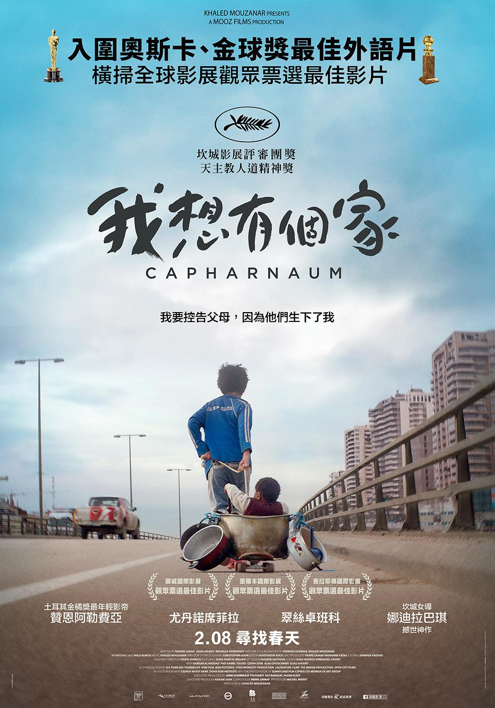
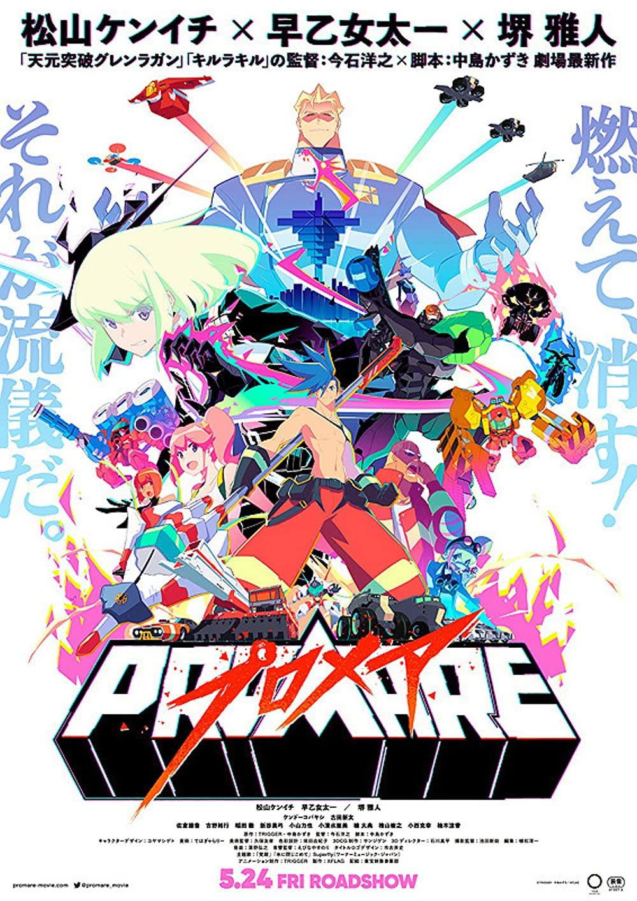

# 待看清單

<!-- AUTO-PREVIEW:START (RENDERPREVIEW:path=./movie_info/&listType=candidate) -->
- [我想有個家 (Capharnaüm, 2018)](#我想有個家-capharnaüm-2018)
- [煙囪小鎮的普佩 (えんとつ町のプペル, 2020)](#煙囪小鎮的普佩-えんとつ町のプペル-2020)
- [媽的多重宇宙 (Everything Everywhere All at Once, 2022)](#媽的多重宇宙-everything-everywhere-all-at-once-2022)
- [我想吃掉你的胰臟 (君の膵臓をたべたい, 動畫電影版, 2018)](#我想吃掉你的胰臟-君の膵臓をたべたい-動畫電影版-2018)
- [喬瑟與虎與魚群 (ジョゼと虎と魚たち, 2020)](#喬瑟與虎與魚群-ジョゼと虎と魚たち-2020)
- [普羅米亞 (Promare, 2019)](#普羅米亞-promare-2019)
- [大娛樂家 (The Greatest Showman, 2017)](#大娛樂家-the-greatest-showman-2017)
- [超級瑪利歐兄弟電影版 (The Super Mario Bros. Movie, 2023)](#超級瑪利歐兄弟電影版-the-super-mario-bros.-movie-2023)

---
## [我想有個家 (Capharnaüm, 2018)](https://www.imdb.com/title/tt8267604/)
### 片長：2 小時 06 分鐘
12歲男孩贊恩出生在破敗的貧民窟，父母只生不養，更無力賺錢養家，導致孩子淪為沒有身分證明的黑戶，生活處境雪上加霜。懂事的贊恩幫忙父母照料家中7個小孩，更每天一早上街頭叫賣果汁賺錢，一肩扛起家中經濟重擔。不料父母卻因缺錢走投無路，竟將年僅11歲的妹妹「賣」給商人當作老婆。無力保護妹妹的贊恩難過地離家出走，此時卻傳來妹妹意外身亡的噩耗...。忍無可忍的贊恩，持刀為妹妹報仇而犯下罪刑，更在獄中反控父母，讓他誕生在這個不公不義的世界...。

---
## [煙囪小鎮的普佩 (えんとつ町のプペル, 2020)](https://www.imdb.com/title/tt13276012/)
### 片長：1 小時 40 分鐘
一段深信「星星」存在的少年．魯必奇與垃圾人．普佩，為了守護希望與夢想的冒險故事。父親總是告訴魯必奇，在與世隔絕、煙霧迷漫的煙囪小鎮上空另一側有著「星星的存在」，為了找出「真相」，魯必奇與普佩展開一場大冒險。

---
## [媽的多重宇宙 (Everything Everywhere All at Once, 2022)](https://www.imdb.com/title/tt6710474)
### 片長：2 小時 19 分鐘
5歲的美國華裔移民秀蓮家庭事業兩崩潰。在老爸爸生日大壽這天，除了要阻止女兒暴走出櫃、替無用丈夫擦屁股，還得去稅務局向古板大嬸解釋不太妙的稅務問題。甫踏進大樓電梯，軟爛丈夫竟搖身一變演起駭客任務，聲稱自己是另一個宇宙的版本，而艾芙琳也是千萬宇宙裡的其中一個。還來不及理解，邪惡勢力已在多元宇宙中蔓延，世界即將毀滅，只有在這它媽的宇宙裡、一無是處的艾芙琳才能拯救世界…

---
## [我想吃掉你的胰臟 (君の膵臓をたべたい, 動畫電影版, 2018)](https://www.imdb.com/title/tt7236034/)
### 片長：1 小時 49 分鐘
「我」偶然在醫院裡發現了一本「共病文庫」，原來這是同班同學 山內櫻良與疾病的奮鬥日記，內容寫著因胰臟病將不久於人世以及她的願望清單，「沒有名字的我」與「沒有未來她」就此相遇了...

---
## [喬瑟與虎與魚群 (ジョゼと虎と魚たち, 2020)](https://www.imdb.com/title/tt12879624/)
### 片長：1 小時 38 分鐘
與祖母同住、不良於行的少女「喬瑟」，雖然從小坐在輪椅上，卻因為熱愛繪畫與書籍，讓她能以天馬行空的想像力，活在自己所構築的世界當中。專攻海洋生物學的男大生「恒夫」，為了能出國留學，並親眼目睹墨西哥的幻之魚群，而努力打工實現願望。某夜，兩人因為一場有驚無險的意外而相遇。喬瑟的祖母也給了恒夫一份工作，要他陪伴在喬瑟身邊。然而個性扭曲又毒舌的喬瑟，卻讓恒夫逐漸對她失去耐心，甚至開始跟她產生衝突。就當兩人逐漸看見彼此不為人知的面貌時，彼此心的距離也為之貼近。這也讓喬瑟決定跟隨恒夫，踏進自己從未見過的外在世界...

---
## [普羅米亞 (Promare, 2019)](https://www.imdb.com/title/tt9116358/)
### 片長：1 小時 51 分鐘
因突變而產生能操控火焰的人種「燃燒者」，讓半個世界被大火燒成焦土，陷入前所未見的慘況，在那之後過了30年，當中一群激進份子「瘋狂燃燒者」再次對世界發動攻擊，為了鎮壓「瘋狂燃燒者」引發的火災，普羅米波利斯自治共和國司政官古雷，組織了針對「燃燒者」而設置的高機動救命消防隊「烈焰救火隊」。效命於「烈焰救火隊」，並擁有滅火之魂的消防隊新人加洛，碰上了被通緝中的縱火恐怖份子、也是「瘋狂燃燒者」首領里歐，兩人發生了激烈的衝突，當兩個熾熱靈魂彼此衝撞，這場對決將迎向什麼結局？

---
## [大娛樂家 (The Greatest Showman, 2017)](https://www.imdb.com/title/tt1485796/)
### 片長：1 小時 45 分鐘
【大娛樂家】改編自傳奇馬戲團始祖P.T.巴納姆(休傑克曼 飾)，描述他如何從窮困潦倒的無名小卒，搖身一變成為一個能夠將歡樂、感動、勇氣與淚水，這些情感原素全部融入至他的表演中，將希望散播至全世界的玩夢大師

---
## [超級瑪利歐兄弟電影版 (The Super Mario Bros. Movie, 2023)](https://www.imdb.com/title/tt6718170/)
### 片長：1 小時 32 分鐘
任天堂暨照明娛樂共同出品一部改編自最受歡迎電玩遊戲《超級瑪利歐兄弟》的全新動畫片《超級瑪利歐兄弟電影版》。

---

<!-- AUTO-PREVIEW:END *-->
