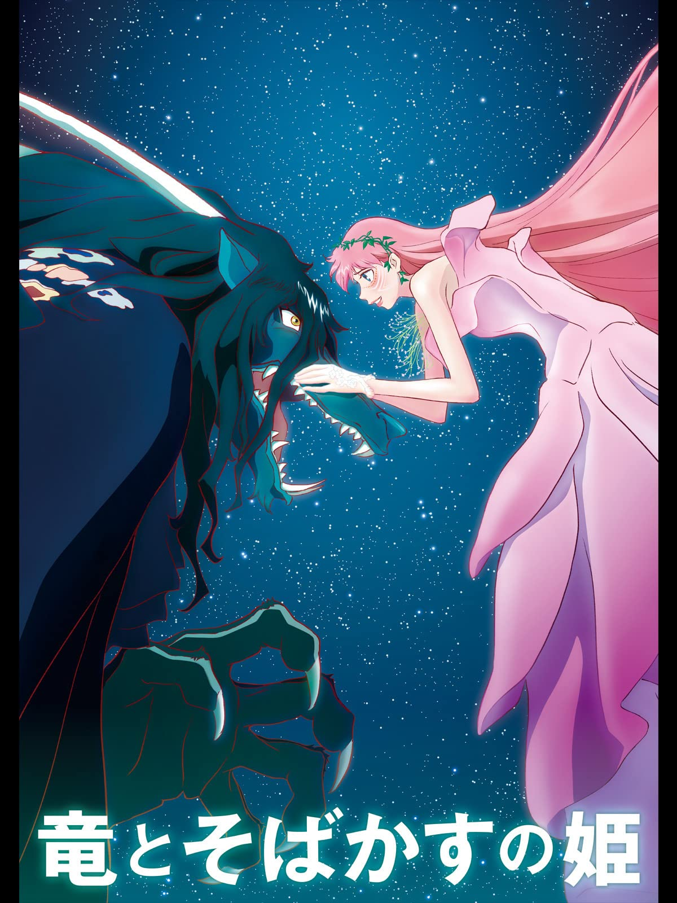

# 電影清單

<!-- AUTO-PREVIEW:START (RENDERPREVIEW:path=./movie_info/) -->
- [一個巨星的誕生 (A Star Is Born, 2018)](#一個巨星的誕生-a-star-is-born-2018)
- [在車上 (Drive My Car, 2021)](#在車上-drive-my-car-2021)
- [煙囪小鎮的普佩 (えんとつ町のプペル, 2020)](#煙囪小鎮的普佩-えんとつ町のプペル-2020)
- [媽的多重宇宙 (Everything Everywhere All at Once, 2022)](#媽的多重宇宙-everything-everywhere-all-at-once-2022)
- [我想吃掉你的胰臟 (君の膵臓をたべたい, 動畫電影版, 2018)](#我想吃掉你的胰臟-君の膵臓をたべたい-動畫電影版-2018)
- [小丑 (Joker, 2019)](#小丑-joker-2019)
- [喬瑟與虎與魚群 (ジョゼと虎と魚たち, 2020)](#喬瑟與虎與魚群-ジョゼと虎と魚たち-2020)
- [咒術迴戰 0 (Jujutsu Kaisen 0, 2021)](#咒術迴戰-0-jujutsu-kaisen-0-2021)
- [波斯語課 (Persian Lessons, 2020)](#波斯語課-persian-lessons-2020)
- [酷愛電影的龐波小姐 (映画大好きポンポさん, 2021)](#酷愛電影的龐波小姐-映画大好きポンポさん-2021)
- [普羅米亞 (Promare, 2019)](#普羅米亞-promare-2019)
- [龍與雀斑公主 (竜とそばかすの姫, 2021)](#龍與雀斑公主-竜とそばかすの姫-2021)
- [劇場版擅長捉弄人的高木同學 (劇場版からかい上手の高木さん, 2022)](#劇場版擅長捉弄人的高木同學-劇場版からかい上手の高木さん-2022)
- [鹿王 (The Deer King, 2021)](#鹿王-the-deer-king-2021)
- [大娛樂家 (The Greatest Showman, 2017)](#大娛樂家-the-greatest-showman-2017)

---
## [一個巨星的誕生 (A Star Is Born, 2018)](https://www.imdb.com/title/tt1517451/)
### 片長：2 小時 16 分鐘
有豐富演唱與表演經驗的音樂老手傑克森，他深受酒癮之苦，一晚在一場演唱會後的酒吧，發掘了擁有極佳音樂天賦的藝術家艾利，與她墜入情網，並鼓勵她不要放棄歌手的夢想。然而，當傑克森給予了艾利機會站在鎂光燈下，她的歌聲逐漸受到矚目與喜愛，艾利的崛起卻讓傑克森更陷入低潮，傑克森與艾利的戀情逐漸瀕臨破局，私生活也變成了一場惡夢。

---
## [在車上 (Drive My Car, 2021)](https://www.imdb.com/title/tt14039582/)
### 片長：2 小時 59 分鐘
在意外喪妻兩年後，知名的舞台劇演員及導演家福裕介被邀請為廣島戲劇節製作舞台劇。在那裡，因工作關係需要聘請一位汽車代駕，家福遇見了沈默寡言的美沙紀，兩人在一趟趟安靜的車程中，漸漸瞭解了彼此的過往，也解開了自己難解的心結，更發現了心愛妻子生前的秘密......

---
## [煙囪小鎮的普佩 (えんとつ町のプペル, 2020)](https://www.imdb.com/title/tt13276012/)
### 片長：1 小時 40 分鐘
一段深信「星星」存在的少年．魯必奇與垃圾人．普佩，為了守護希望與夢想的冒險故事。父親總是告訴魯必奇，在與世隔絕、煙霧迷漫的煙囪小鎮上空另一側有著「星星的存在」，為了找出「真相」，魯必奇與普佩展開一場大冒險。

---
## [媽的多重宇宙 (Everything Everywhere All at Once, 2022)](https://www.imdb.com/title/tt6710474)
### 片長：2 小時 19 分鐘
5歲的美國華裔移民秀蓮家庭事業兩崩潰。在老爸爸生日大壽這天，除了要阻止女兒暴走出櫃、替無用丈夫擦屁股，還得去稅務局向古板大嬸解釋不太妙的稅務問題。甫踏進大樓電梯，軟爛丈夫竟搖身一變演起駭客任務，聲稱自己是另一個宇宙的版本，而艾芙琳也是千萬宇宙裡的其中一個。還來不及理解，邪惡勢力已在多元宇宙中蔓延，世界即將毀滅，只有在這它媽的宇宙裡、一無是處的艾芙琳才能拯救世界…

---
## [我想吃掉你的胰臟 (君の膵臓をたべたい, 動畫電影版, 2018)](https://www.imdb.com/title/tt7236034/)
### 片長：1 小時 49 分鐘
「我」偶然在醫院裡發現了一本「共病文庫」，原來這是同班同學 山內櫻良與疾病的奮鬥日記，內容寫著因胰臟病將不久於人世以及她的願望清單，「沒有名字的我」與「沒有未來她」就此相遇了...

---
## [小丑 (Joker, 2019)](https://www.imdb.com/title/tt7286456/)
### 片長：2 小時 02 分鐘
一名罹患精神病、生活貧窮且遭受社會遺棄的獨角喜劇演員，在探查自己的身世以及尋找“真正自我”的過程中一步一步成為一個虛無主義的罪犯。

---
## [喬瑟與虎與魚群 (ジョゼと虎と魚たち, 2020)](https://www.imdb.com/title/tt12879624/)
### 片長：1 小時 38 分鐘
與祖母同住、不良於行的少女「喬瑟」，雖然從小坐在輪椅上，卻因為熱愛繪畫與書籍，讓她能以天馬行空的想像力，活在自己所構築的世界當中。專攻海洋生物學的男大生「恒夫」，為了能出國留學，並親眼目睹墨西哥的幻之魚群，而努力打工實現願望。某夜，兩人因為一場有驚無險的意外而相遇。喬瑟的祖母也給了恒夫一份工作，要他陪伴在喬瑟身邊。然而個性扭曲又毒舌的喬瑟，卻讓恒夫逐漸對她失去耐心，甚至開始跟她產生衝突。就當兩人逐漸看見彼此不為人知的面貌時，彼此心的距離也為之貼近。這也讓喬瑟決定跟隨恒夫，踏進自己從未見過的外在世界...

---
## [咒術迴戰 0 (Jujutsu Kaisen 0, 2021)](https://www.imdb.com/title/tt14331144/)
### 片長：1 小時 52 分鐘
自幼感情極好的乙骨憂太與祈本里香約好長大後要結婚，卻不料里香因死亡車禍化為強大怨靈依附在憂太身邊，為此所苦的憂太一心求死，之後在五條悟的帶領下進入咒術高專結識了新同學：禪院真希、狗卷棘與熊貓，他決定在這裡找到活下去的自信並解除里香的詛咒。意欲奪取里香強大怨靈力量的夏油傑宣布在 12 月 24 日舉行「百鬼夜行」，在新宿與京都釋出上千個詛咒。面臨如此重大浩劫，憂太能否阻止夏油的野心並解開里香的詛咒？

---
## [波斯語課 (Persian Lessons, 2020)](https://www.imdb.com/title/tt9738784/)
### 片長：2 小時 07 分鐘
1942年二戰期間，一名年輕猶太人吉爾斯遭德軍逮捕，正要被送往集中營處決時，他謊稱自己是波斯人而逃過一劫，沒想到卻遇到一名德國軍官克勞斯，他夢想在二戰結束後前往伊朗開餐廳，便命令吉爾斯教他波斯語。完全不懂波斯語的吉爾斯急中生智，靠著瞎掰讓克勞斯在半信半疑之下接受他的教學。兩人也在教學過程中，漸漸發展出一段不平凡的友誼...

---
## [酷愛電影的龐波小姐 (映画大好きポンポさん, 2021)](https://www.imdb.com/title/tt12439248/)
### 片長：1 小時 34 分鐘
《酷愛電影的龐波小姐》原作漫畫由杉谷庄吾所創作，描述才華橫溢的電影製作人龐波小姐，在電影之都喵萊塢日夜不停地埋頭於電影製作的世界。某一天，龐波小姐的助手，「電影之蟲」吉恩突然被她指名為導演？！「這個劇本，就由你來拍攝吧！！」

---
## [普羅米亞 (Promare, 2019)](https://www.imdb.com/title/tt9116358/)
### 片長：1 小時 51 分鐘
因突變而產生能操控火焰的人種「燃燒者」，讓半個世界被大火燒成焦土，陷入前所未見的慘況，在那之後過了30年，當中一群激進份子「瘋狂燃燒者」再次對世界發動攻擊，為了鎮壓「瘋狂燃燒者」引發的火災，普羅米波利斯自治共和國司政官古雷，組織了針對「燃燒者」而設置的高機動救命消防隊「烈焰救火隊」。效命於「烈焰救火隊」，並擁有滅火之魂的消防隊新人加洛，碰上了被通緝中的縱火恐怖份子、也是「瘋狂燃燒者」首領里歐，兩人發生了激烈的衝突，當兩個熾熱靈魂彼此衝撞，這場對決將迎向什麼結局？

---
## [龍與雀斑公主 (竜とそばかすの姫, 2021)](https://www.imdb.com/title/tt13651628/)
### 片長：2 小時 01 分鐘
自幼因意外失去母親的17歲女高中生小鈴，與父親兩人同住在人口不斷外移的高知小農村。最喜歡和母親一起唱歌的小鈴，母親死後便再也無法開口唱歌，在現實世界中甚至將自己的內心封閉起來。某日，小鈴化名「貝兒」來到全球超過50億使用者的虛擬世界「U」，貝兒在虛擬世界能自然開口唱歌，並發表自己創作的歌曲，更讓她成為世界關注的焦點，此時一個有著龍姿態的神祕存在突然出現在小鈴面前...

---
## [劇場版擅長捉弄人的高木同學 (劇場版からかい上手の高木さん, 2022)](https://www.imdb.com/title/tt15313532/)
### 片長：1 小時 13 分鐘
升上中學的少年西片，與和他同班、常對他捉弄嬉戲的少女高木，心裡開始對往後的未來充滿著期待與不安。在中學最後一次暑假的前一天裡，他們在神社裡看到一隻名叫小花 (ハナ) 的小貓。因為找不到母貓的身影，西片和高木兩人展開了一段一起照顧小貓的暑假時光。

---
## [鹿王 (The Deer King, 2021)](https://www.imdb.com/title/tt11417856/)
### 片長：1 小時 53 分鐘
 戰士凡恩在戰爭中敗北，淪為奴隸被囚禁在地下鹽礦，某天晚上，一群神秘的山犬襲擊鹽礦，礦坑裡的人皆一一死去，活下來的只有凡恩與小女孩悠娜，幸運存活下來的兩人，為了逃避追捕而開始逃亡。

---
## [大娛樂家 (The Greatest Showman, 2017)](https://www.imdb.com/title/tt1485796/)
### 片長：1 小時 45 分鐘
【大娛樂家】改編自傳奇馬戲團始祖P.T.巴納姆(休傑克曼 飾)，描述他如何從窮困潦倒的無名小卒，搖身一變成為一個能夠將歡樂、感動、勇氣與淚水，這些情感原素全部融入至他的表演中，將希望散播至全世界的玩夢大師

---

<!-- AUTO-PREVIEW:END *-->
