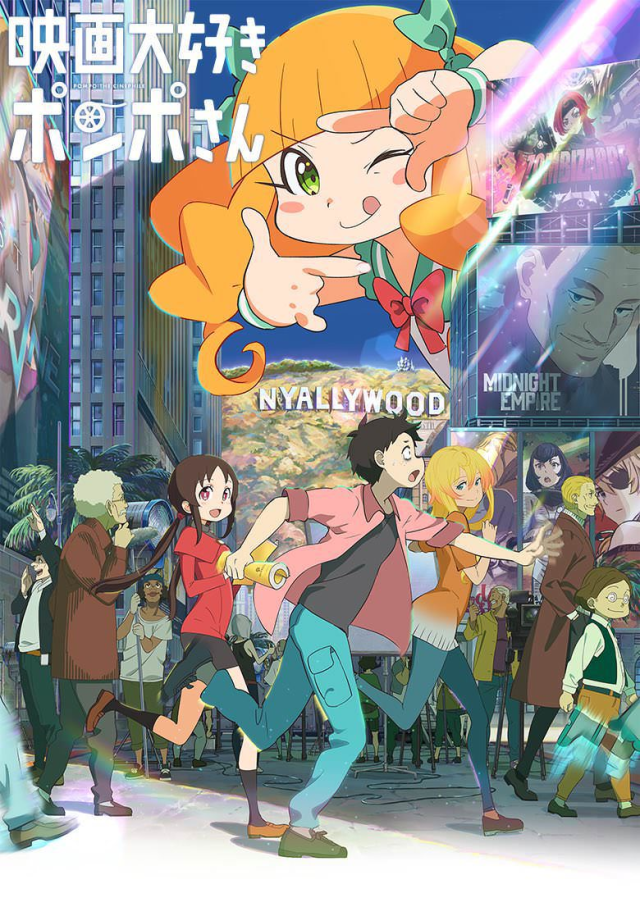

# 已完食清單

<!-- AUTO-PREVIEW:START (RENDERPREVIEW:path=./movie_info/&listType=watched) -->
- [在車上 (Drive My Car, 2021)](#在車上-drive-my-car-2021)
- [咒術迴戰 0 (Jujutsu Kaisen 0, 2021)](#咒術迴戰-0-jujutsu-kaisen-0-2021)
- [酷愛電影的龐波小姐 (映画大好きポンポさん, 2021)](#酷愛電影的龐波小姐-映画大好きポンポさん-2021)
- [龍與雀斑公主 (竜とそばかすの姫, 2021)](#龍與雀斑公主-竜とそばかすの姫-2021)
- [劇場版擅長捉弄人的高木同學 (劇場版からかい上手の高木さん, 2022)](#劇場版擅長捉弄人的高木同學-劇場版からかい上手の高木さん-2022)
- [鹿王 (The Deer King, 2021)](#鹿王-the-deer-king-2021)

---
## [在車上 (Drive My Car, 2021)](https://www.imdb.com/title/tt14039582/)
### 片長：2 小時 59 分鐘
在意外喪妻兩年後，知名的舞台劇演員及導演家福裕介被邀請為廣島戲劇節製作舞台劇。在那裡，因工作關係需要聘請一位汽車代駕，家福遇見了沈默寡言的美沙紀，兩人在一趟趟安靜的車程中，漸漸瞭解了彼此的過往，也解開了自己難解的心結，更發現了心愛妻子生前的秘密......

---
## [咒術迴戰 0 (Jujutsu Kaisen 0, 2021)](https://www.imdb.com/title/tt14331144/)
### 片長：1 小時 52 分鐘
自幼感情極好的乙骨憂太與祈本里香約好長大後要結婚，卻不料里香因死亡車禍化為強大怨靈依附在憂太身邊，為此所苦的憂太一心求死，之後在五條悟的帶領下進入咒術高專結識了新同學：禪院真希、狗卷棘與熊貓，他決定在這裡找到活下去的自信並解除里香的詛咒。意欲奪取里香強大怨靈力量的夏油傑宣布在 12 月 24 日舉行「百鬼夜行」，在新宿與京都釋出上千個詛咒。面臨如此重大浩劫，憂太能否阻止夏油的野心並解開里香的詛咒？

---
## [酷愛電影的龐波小姐 (映画大好きポンポさん, 2021)](https://www.imdb.com/title/tt12439248/)
### 片長：1 小時 34 分鐘
《酷愛電影的龐波小姐》原作漫畫由杉谷庄吾所創作，描述才華橫溢的電影製作人龐波小姐，在電影之都喵萊塢日夜不停地埋頭於電影製作的世界。某一天，龐波小姐的助手，「電影之蟲」吉恩突然被她指名為導演？！「這個劇本，就由你來拍攝吧！！」

---
## [龍與雀斑公主 (竜とそばかすの姫, 2021)](https://www.imdb.com/title/tt13651628/)
### 片長：2 小時 01 分鐘
自幼因意外失去母親的17歲女高中生小鈴，與父親兩人同住在人口不斷外移的高知小農村。最喜歡和母親一起唱歌的小鈴，母親死後便再也無法開口唱歌，在現實世界中甚至將自己的內心封閉起來。某日，小鈴化名「貝兒」來到全球超過50億使用者的虛擬世界「U」，貝兒在虛擬世界能自然開口唱歌，並發表自己創作的歌曲，更讓她成為世界關注的焦點，此時一個有著龍姿態的神祕存在突然出現在小鈴面前...

---
## [劇場版擅長捉弄人的高木同學 (劇場版からかい上手の高木さん, 2022)](https://www.imdb.com/title/tt15313532/)
### 片長：1 小時 13 分鐘
升上中學的少年西片，與和他同班、常對他捉弄嬉戲的少女高木，心裡開始對往後的未來充滿著期待與不安。在中學最後一次暑假的前一天裡，他們在神社裡看到一隻名叫小花 (ハナ) 的小貓。因為找不到母貓的身影，西片和高木兩人展開了一段一起照顧小貓的暑假時光。

---
## [鹿王 (The Deer King, 2021)](https://www.imdb.com/title/tt11417856/)
### 片長：1 小時 53 分鐘
 戰士凡恩在戰爭中敗北，淪為奴隸被囚禁在地下鹽礦，某天晚上，一群神秘的山犬襲擊鹽礦，礦坑裡的人皆一一死去，活下來的只有凡恩與小女孩悠娜，幸運存活下來的兩人，為了逃避追捕而開始逃亡。

---

<!-- AUTO-PREVIEW:END *-->
